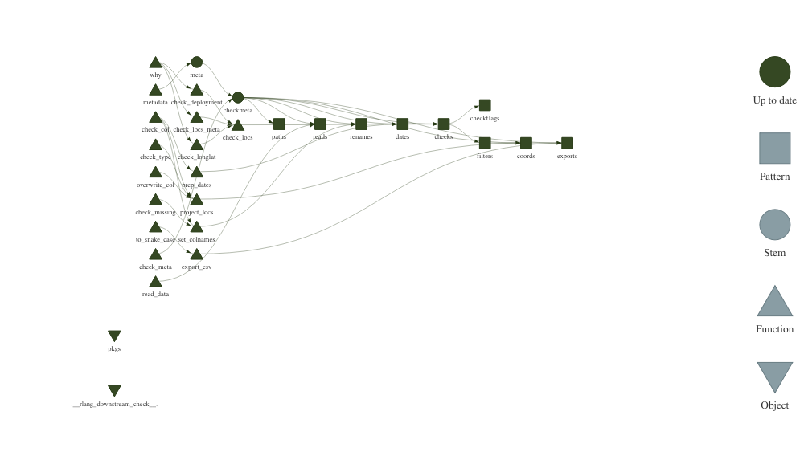

prepare-locs
================

-   [Input](#input)
-   [Output](#output)
    -   [Files](#files)
    -   [Column names](#column-names)
    -   [Flag counts](#flag-counts)
-   [TODO](#todo)
-   [Etc](#etc)

------------------------------------------------------------------------

A `targets` workflow for processing animal relocation data for the WEEL.

``` r
library(targets)
tar_visnetwork()
```

<!-- -->

# Input

``` r
tar_read(meta)
```

| path                                                                   | name                             | x\_long  | y\_lat   | id         | datetime  | extracols                                                                | tz  | epsgin     | epsgout | date      | time      | splitBy | deployment                              |
|:-----------------------------------------------------------------------|:---------------------------------|:---------|:---------|:-----------|:----------|:-------------------------------------------------------------------------|:----|:-----------|--------:|:----------|:----------|:--------|:----------------------------------------|
| ../fogo-caribou/data/FogoCaribou.csv                                   | NL-Fogo-Caribou-Telemetry        | X\_COORD | Y\_COORD | ANIMAL\_ID | datetime  | NA                                                                       | UTC | 4326       |   32621 | NA        | NA        | NA      | NA                                      |
| ../metadata/data/NL/Provincial/Caribou/Telemetry/AllCaribouDataRaw.csv | NL-Provincial-Caribou-Telemetry  | X\_COORD | Y\_COORD | ANIMAL\_ID | NA        | COLLAR\_TYPE\_CL, HERD , Map\_Quality , EPSG\_CODE , EXCLUDE , DOP , NAV | UTC | EPSG\_CODE |   32621 | FIX\_DATE | FIX\_TIME | HERD    | NA                                      |
| input/vita\_elk\_lotek\_feb\_2016-july\_2019.csv                       | MB-Vita-Elk-Telemetry\_Lotek     | long     | lat      | animal\_ID | time\_utc | status                                                                   | UTC | 4326       |   32614 | NA        | NA        | NA      | input/vita-elk-lotek-deployment.csv     |
| input/vita\_elk\_vectronic\_feb\_2019-march\_2021.csv                  | MB-Vita-Elk-Telemetry\_Vectronic | long     | lat      | animal\_ID | time\_utc | status                                                                   | UTC | 4326       |   32614 | NA        | NA        | NA      | input/vita-elk-vectronic-deployment.csv |
| input/RMNP\_elk\_2006\_2015.csv                                        | MB-RMNP-Elk-Telemetry            | long     | lat      | EarTag     | DateTime  | NA                                                                       | GMT | 4326       |   32614 | NA        | NA        | NA      | NA                                      |

# Output

## Files

``` r
tar_read(exports)
```

| output\_path                                         | n\_rows | column\_names                                                                                                    | herd     |
|:-----------------------------------------------------|--------:|:-----------------------------------------------------------------------------------------------------------------|:---------|
| output/NL-Fogo-Caribou-Telemetry.csv                 |  156019 | name , id , datetime, x\_long , y\_lat , idate , doy , yr , mnth , flag , x\_proj , y\_proj                      | NA       |
| output/NL-Provincial-Caribou-Telemetry\_BUCHANS.csv  |  254028 | name , id , datetime , x\_long , y\_lat , herd , idate , doy , yr , mnth , flag , x\_proj , y\_proj , epsg\_proj | BUCHANS  |
| output/NL-Provincial-Caribou-Telemetry\_GREY.csv     |  270983 | name , id , datetime , x\_long , y\_lat , herd , idate , doy , yr , mnth , flag , x\_proj , y\_proj , epsg\_proj | GREY     |
| output/NL-Provincial-Caribou-Telemetry\_GREYVIC.csv  |   11136 | name , id , datetime , x\_long , y\_lat , herd , idate , doy , yr , mnth , flag , x\_proj , y\_proj , epsg\_proj | GREYVIC  |
| output/NL-Provincial-Caribou-Telemetry\_GROSMORN.csv |   42136 | name , id , datetime , x\_long , y\_lat , herd , idate , doy , yr , mnth , flag , x\_proj , y\_proj , epsg\_proj | GROSMORN |
| output/NL-Provincial-Caribou-Telemetry\_LAPOILE.csv  |  247849 | name , id , datetime , x\_long , y\_lat , herd , idate , doy , yr , mnth , flag , x\_proj , y\_proj , epsg\_proj | LAPOILE  |
| output/NL-Provincial-Caribou-Telemetry\_MIDRIDGE.csv |  389278 | name , id , datetime , x\_long , y\_lat , herd , idate , doy , yr , mnth , flag , x\_proj , y\_proj , epsg\_proj | MIDRIDGE |
| output/NL-Provincial-Caribou-Telemetry\_MTPEYTON.csv |   55030 | name , id , datetime , x\_long , y\_lat , herd , idate , doy , yr , mnth , flag , x\_proj , y\_proj , epsg\_proj | MTPEYTON |
| output/NL-Provincial-Caribou-Telemetry\_OLDMANS.csv  |   11536 | name , id , datetime , x\_long , y\_lat , herd , idate , doy , yr , mnth , flag , x\_proj , y\_proj , epsg\_proj | OLDMANS  |
| output/NL-Provincial-Caribou-Telemetry\_POTHILL.csv  |  242092 | name , id , datetime , x\_long , y\_lat , herd , idate , doy , yr , mnth , flag , x\_proj , y\_proj , epsg\_proj | POTHILL  |
| output/NL-Provincial-Caribou-Telemetry\_STEPHENV.csv |   44772 | name , id , datetime , x\_long , y\_lat , herd , idate , doy , yr , mnth , flag , x\_proj , y\_proj , epsg\_proj | STEPHENV |
| output/NL-Provincial-Caribou-Telemetry\_TOPSAILS.csv |  356426 | name , id , datetime , x\_long , y\_lat , herd , idate , doy , yr , mnth , flag , x\_proj , y\_proj , epsg\_proj | TOPSAILS |
| output/NL-Provincial-Caribou-Telemetry\_UNKNOWN.csv  |   15818 | name , id , datetime , x\_long , y\_lat , herd , idate , doy , yr , mnth , flag , x\_proj , y\_proj , epsg\_proj | UNKNOWN  |
| output/MB-Vita-Elk-Telemetry\_Lotek.csv              |   10022 | name , id , datetime, x\_long , y\_lat , idate , doy , yr , mnth , flag , x\_proj , y\_proj                      | NA       |
| output/MB-Vita-Elk-Telemetry\_Vectronic.csv          |  208239 | name , id , datetime, x\_long , y\_lat , idate , doy , yr , mnth , flag , x\_proj , y\_proj                      | NA       |
| output/MB-RMNP-Elk-Telemetry.csv                     |   50080 | name , id , datetime, x\_long , y\_lat , idate , doy , yr , mnth , flag , x\_proj , y\_proj                      | NA       |

## Column names

| Column name   | Description                                                                  |
|---------------|------------------------------------------------------------------------------|
| id            | unique animal identifier                                                     |
| datetime      | date time in UTC                                                             |
| doy           | date of year, integer. see `data.table::yday()`                              |
| mnth          | month, integer. see `data.table::month()`                                    |
| yr            | year, integer. see `data.table::year()`                                      |
| x\_long       | longitude, EPSG code provided in `metadata()`. see `R/metadata.R`            |
| y\_lat        | latitude, EPSG code provided in `metadata()`. see `R/metadata.R`             |
| x\_proj       | projected x coordinate, output EPSG code in `metadata()`. see `R/metadata.R` |
| y\_proj       | projected y coordinate, output EPSG code in `metadata()`. see `R/metadata.R` |
| epsg\_proj    | output EPSG of ‘x\_proj’ and ‘y\_proj’ as set in `metadata()`.               |
| flag          | semi-colon separated flags indicating why locs are dropped and set to NaN    |
| \[extracols\] | eg. HERD. as provided in the `metadata()`. see `R/metadata.R`                |

## Flag counts

``` r
tar_read(checkflags)
```

| name                             | flag                                                                                                       |       N |
|:---------------------------------|:-----------------------------------------------------------------------------------------------------------|--------:|
| NL-Fogo-Caribou-Telemetry        | NA                                                                                                         |  156019 |
| NL-Fogo-Caribou-Telemetry        | x\_long is NA; y\_lat is NA                                                                                |    4625 |
| NL-Fogo-Caribou-Telemetry        | x\_long is NA; y\_lat is NA; loc is duplicated                                                             |   34356 |
| NL-Fogo-Caribou-Telemetry        | loc is duplicated                                                                                          |       9 |
| NL-Provincial-Caribou-Telemetry  | Collar type is ARGOS                                                                                       |  305866 |
| NL-Provincial-Caribou-Telemetry  | Map\_Quality is N; Collar type is ARGOS                                                                    |    1114 |
| NL-Provincial-Caribou-Telemetry  | Collar type is VHF                                                                                         |   24053 |
| NL-Provincial-Caribou-Telemetry  | loc is duplicated; Collar type is ARGOS                                                                    |      26 |
| NL-Provincial-Caribou-Telemetry  | NA                                                                                                         | 1941084 |
| NL-Provincial-Caribou-Telemetry  | DOP &gt; 10                                                                                                |    7352 |
| NL-Provincial-Caribou-Telemetry  | NAV is 2D                                                                                                  |   22174 |
| NL-Provincial-Caribou-Telemetry  | x\_long is 0; y\_lat is 0; x\_long == y\_lat; Map\_Quality is N; DOP &gt; 10; NAV is No                    |    4239 |
| NL-Provincial-Caribou-Telemetry  | DOP &gt; 10; NAV is 2D                                                                                     |    1112 |
| NL-Provincial-Caribou-Telemetry  | x\_long is 0; y\_lat is 0; x\_long == y\_lat; loc is duplicated; Map\_Quality is N; DOP &gt; 10; NAV is No |    5746 |
| NL-Provincial-Caribou-Telemetry  | loc is duplicated                                                                                          |     310 |
| NL-Provincial-Caribou-Telemetry  | Map\_Quality is N; NAV is 2D                                                                               |      83 |
| NL-Provincial-Caribou-Telemetry  | x\_long is 0; y\_lat is 0; x\_long == y\_lat; Map\_Quality is N; NAV is No                                 |    2883 |
| NL-Provincial-Caribou-Telemetry  | x\_long is 0; y\_lat is 0; x\_long == y\_lat; loc is duplicated; Map\_Quality is N; NAV is No              |    7866 |
| NL-Provincial-Caribou-Telemetry  | Map\_Quality is N; DOP &gt; 10; NAV is 2D                                                                  |      18 |
| NL-Provincial-Caribou-Telemetry  | loc is duplicated; NAV is 2D                                                                               |      58 |
| NL-Provincial-Caribou-Telemetry  | Map\_Quality is N                                                                                          |    8657 |
| NL-Provincial-Caribou-Telemetry  | Map\_Quality is N; DOP &gt; 10                                                                             |      15 |
| NL-Provincial-Caribou-Telemetry  | loc is duplicated; Map\_Quality is N                                                                       |      12 |
| MB-Vita-Elk-Telemetry\_Lotek     | fix date before deployment                                                                                 |     473 |
| MB-Vita-Elk-Telemetry\_Lotek     | NA                                                                                                         |   10022 |
| MB-Vita-Elk-Telemetry\_Lotek     | x\_long is NA; y\_lat is NA; status is not 3D                                                              |     120 |
| MB-Vita-Elk-Telemetry\_Lotek     | status is not 3D                                                                                           |      22 |
| MB-Vita-Elk-Telemetry\_Lotek     | x\_long is NA; y\_lat is NA; status is not 3D; fix date before deployment                                  |       1 |
| MB-Vita-Elk-Telemetry\_Lotek     | x\_long is NA; y\_lat is NA; loc is duplicated; status is not 3D                                           |       5 |
| MB-Vita-Elk-Telemetry\_Lotek     | loc is duplicated                                                                                          |       2 |
| MB-Vita-Elk-Telemetry\_Vectronic | fix date before deployment                                                                                 |     102 |
| MB-Vita-Elk-Telemetry\_Vectronic | loc is duplicated; fix date before deployment                                                              |      10 |
| MB-Vita-Elk-Telemetry\_Vectronic | NA                                                                                                         |  208239 |
| MB-Vita-Elk-Telemetry\_Vectronic | loc is duplicated                                                                                          |    5899 |
| MB-Vita-Elk-Telemetry\_Vectronic | status is not 3D                                                                                           |     723 |
| MB-Vita-Elk-Telemetry\_Vectronic | x\_long is NA; y\_lat is NA; status is not 3D                                                              |     182 |
| MB-Vita-Elk-Telemetry\_Vectronic | loc is duplicated; status is not 3D                                                                        |       7 |
| MB-Vita-Elk-Telemetry\_Vectronic | status is not 3D; fix date before deployment                                                               |       1 |
| MB-Vita-Elk-Telemetry\_Vectronic | x\_long is NA; y\_lat is NA; status is not 3D; fix date before deployment                                  |       2 |
| MB-Vita-Elk-Telemetry\_Vectronic | x\_long is NA; y\_lat is NA; loc is duplicated; status is not 3D                                           |       3 |
| MB-RMNP-Elk-Telemetry            | NA                                                                                                         |   50080 |
| MB-RMNP-Elk-Telemetry            | loc is duplicated                                                                                          |      24 |

# TODO

-   6030 not recognized by PROJ because it’s not a complete CRS..

# Etc

Screening GPS fixes:

-   <https://ropensci.github.io/CoordinateCleaner/articles/Comparison_other_software.html>
    -   missing coordinates
    -   lat == 0
    -   long == 0
    -   lat == long
    -   …
-   *Effects of habitat on GPS collar performance: using data screening
    to reduce location error*. Lewis et al. 2007
    -   drop 2D fixes
    -   threshold PDOP
-   *Screening GPS telemetry data for locations having unacceptable
    error*. Laver et al. 
